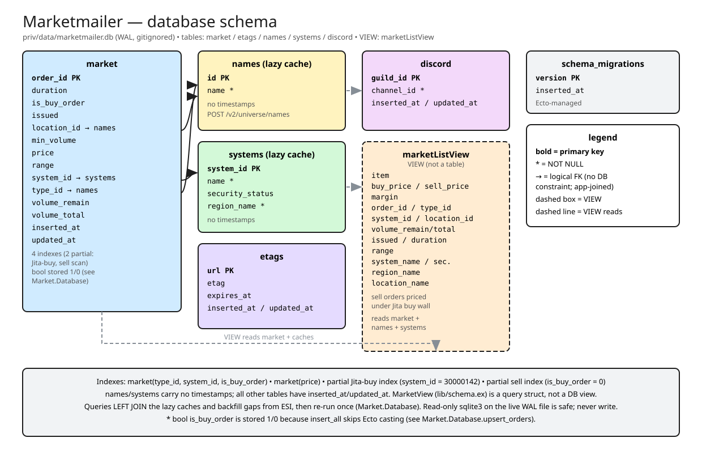
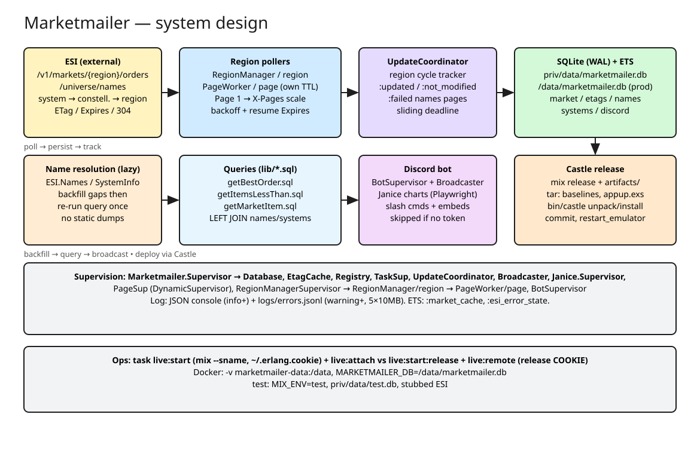

# Marketmailer

EVE Online market watcher. Region pollers fetch market orders from ESI into a
local SQLite database; queries surface arbitrage opportunities ("best order"
to flip into the Jita buy wall). A Discord bot broadcasts market updates.

## Prerequisites

- Elixir (see `mix.exs` for the version) with Mix
- Optional: Docker, for running containerized
- Optional: a Discord bot token, for bot features

## Quick start

```sh
cp .example.env .env   # then fill in values
task setup             # deps.get + ecto.create + ecto.migrate
task start             # prod release detached (daemon, survives terminal close)
```

Or a dev shell with plain mix:

```sh
mix setup
iex -S mix run
```

Pending migrations run automatically on every boot, so containers and
`mix run` never need a separate migrate step. The database file is
`priv/data/marketmailer.db` (gitignored); override with
`MARKETMAILER_DB` (useful for mounting a Docker volume).

## Configuration

| Variable | Required | Description |
| --- | --- | --- |
| `DISCORD_TOKEN` | No | Enables the Discord bot. If missing/invalid the bot is skipped with a warning and the rest of the app keeps running. |
| `MARKETMAILER_DB` | No | Path to the SQLite file (default: `priv/data/marketmailer.db`). |

<!-- Invite the bot to your server: -->
<!-- https://discord.com/oauth2/authorize?client_id=1473196121630314689 -->

## Features

- **Region pollers** (`Marketmailer.RegionManagerSupervisor`) — poll ESI
  market orders per region with dynamic page scaling and exponential backoff.
- **Discord bot** (`Marketmailer.BotSupervisor`) — slash commands, embeds,
  and market-update broadcasts.
- **Name resolution** — type/system/station names resolve lazily from ESI
  into local cache tables; no static data dumps needed.

## Database schema



Editable source: [assets/schema.excalidraw](assets/schema.excalidraw) —
open in excalidraw.com or the VSCode Excalidraw extension, export SVG to
`assets/` after edits.

SQLite at `priv/data/marketmailer.db` (WAL, gitignored): `market` order
cache, `etags` per-page ETag/Expires, lazy `names`/`systems` EVE caches,
`discord` channel routing, plus the `marketListView` undercut view.
`MarketView` (`lib/schema.ex`) is a query struct, not a DB view. Arrows
are logical FKs joined by the app, not DB constraints.

## System design



Editable source: [assets/design.excalidraw](assets/design.excalidraw) —
open in excalidraw.com or the VSCode Excalidraw extension, export SVG to
`assets/` after edits.

Flow: per-page `PageWorker`s poll ESI with their own ETag/Expires TTL
(unchanged pages stay cheap `304`s), upsert into SQLite + ETS, report to
`UpdateCoordinator`; SQL queries `LEFT JOIN` the lazy `names`/`systems`
caches (backfilled from ESI, then re-run once); results go to Discord
embeds/broadcasts. See `AGENTS.md` for architecture, database, and logging
internals.

## Docker

```sh
docker build -t marketmailer .
docker run --rm -p 443:443 \
  -v marketmailer-data:/data \
  -e MARKETMAILER_DB=/data/marketmailer.db \
  marketmailer
```

Or `task docker:build` / `task docker:run`.

## Development

```sh
task compile:strict   # mix compile --warnings-as-errors
task format           # check only; task format:write to write
task test
task migrate          # manual migration run
```

Run `task` with no arguments to list all tasks. See `AGENTS.md` for
architecture, database, and logging internals.
